# Sobre mim

## Muito prazer..

::::: columns
::: {.column width="50%"}
{fig-align="center" width="420"}
:::

::: {.column width="50%" style="font-size: 80%;"}
-   Marcel;

 

-   Físico médico;

 

-   Me e PhD em Biotecnologia;

 

-   Desde 2023, pós-doutorado em genética;
:::
:::::

## Interesses

:::::: columns
::: {.column width="50%"}
{fig-align="center" width="420"}
:::

:::: {.column width="50%" style="font-size: 80%;"}
-   Métodos alternativos ao uso de animais;

-   Identificão humana via DNA;

-   Biologia do tecido ósseo;

-   Biomateriais;

-   Regeneração tecidual;

-   Ciência aberta;

 

::: {#red-highlight style="color: red; font-size: 140%; text-align: center; font-weight: bold;"}
Bioinformática
:::
::::
::::::

## Projeto

[{fig-align="center" width="780"}](https://isbet.org.br/diversidade-no-estagio-e-jovem-aprendiz/)

## Não sou da nanopore

::: {style="text-align: center;"}
<iframe src="https://giphy.com/embed/zFa3vjySsETPa" width="414" height="480" style frameBorder="0" class="giphy-embed" allowFullScreen>

</iframe>

<a href="https://giphy.com/gifs/zFa3vjySsETPa">via GIPHY</a>

:::

# Sobre vocês

## Sobre vocês

::: {style="text-align: center;"}
<iframe src="https://giphy.com/embed/5wWf7H89PisM6An8UAU" width="960" height="558" style frameBorder="0" class="giphy-embed" allowFullScreen>

</iframe>

<a href="https://giphy.com/gifs/editingandlayout-the-office-michael-scott-5wWf7H89PisM6An8UAU">via GIPHY</a>

:::

# Sobre esse minicurso

## Método do ano de 2022

[{fig-align="center" width="516"}](https://www.nature.com/articles/s41592-022-01730-w)

## Passar os atalhos

::::: columns
::: {.column width="50%"}
<iframe src="https://giphy.com/embed/1n833bZxdzKzaErLe9" width="480" height="269" style frameBorder="0" class="giphy-embed" allowFullScreen>

</iframe>

<a href="https://giphy.com/gifs/nba-expression-derrick-white-1n833bZxdzKzaErLe9">via GIPHY</a>

:::

::: {.column width="50%"}
<iframe src="https://giphy.com/embed/Cas0va26zqBvTO5vY9" width="480" height="480" style frameBorder="0" class="giphy-embed" allowFullScreen>

</iframe>

<a href="https://giphy.com/gifs/pudgypenguins-rage-enough-ragequit-Cas0va26zqBvTO5vY9">via GIPHY</a>

:::
:::::

## Bioinformática

-   NIH: "*Bioinformatics, as related to genetics and genomics, is a scientific subdiscipline that involves using computer technology to collect, store, analyze and disseminate biological data and information, such as DNA and amino acid sequences or annotations about those sequences.*"

::: aside
NIH: National Institute of Health
:::

## Bioinformática

-   NIH: "*Bioinformatics, as related to **genetics** and **genomics**, is a scientific subdiscipline that involves using computer technology to **collect**, **store**, **analyze** and **disseminate** biological data and information, such as **DNA** and **amino acid sequences** or annotations about those sequences.*"

::: aside
NIH: National Institute of Health
:::

## Bioinformática

-   Não vamos focar nos algoritmos;

 

-   Mas sim nos dados produzidos e como analisa-los;

# Sequenciamento via ONT

## Ordens de Grandeza do Genoma Humano

-   Número de cromossomos: 46 (23 pares);

-   Tamanho do genoma haploide: \~3,2 bilhões de pares de bases (3,2 Gb);

-   Número estimado de genes codificadores de proteínas: \~20.000;

## 

{fig-align="center"}

## Por que sequenciar?

. . .

-   A sequência é a "receita" da vida

    -   Ela determina a estrutura e função das moléculas biológicas.

-   **DNA** → **RNA** → **Proteína**

    -   Alterações na sequência podem afetar a função celular e causar doenças.

-   Entender a sequência = entender o funcionamento dos organismos

    -   Do gene à característica observável (fenótipo).

-   Permite identificar diferenças genéticas

    -   Entre indivíduos, espécies, populações ou células (ex: câncer).

## Geração de sequenciamento

## Sequenciamento: Comparativo entre Plataformas

 

::: {style="font-size:80%;"}
|  |  |  |  |  |  |
|------------|------------|------------|------------|------------|------------|
| **Plataforma** | **Tipo de Leitura** | **Tamanho de Leitura** | **Taxa de Erro** | **Tempo de Execução** | **Aplicações Comuns** |
| Illumina | Short reads | 150--300 pares de bases | \<1% | 1--2 dias | RNA-seq, exoma, WGS, genotipagem |
| PacBio Hifi | Long reads (alta fidelidade) | 10--25 kb (HiFi) | \~1% | 1--2 dias | Montagem genômica, haplótipos, variantes estruturais |
| Oxford Nanopre | Long/ultralong reads | 10 kb -- \>1 Mb | 5--10% (melhorando) | Horas a 2 dias | Metagenômica, epigenética, transcriptômica, forense |
:::

## Introdução a tecnologia de sequenciamento

[{fig-align="center"}](https://www.genome.gov/geneticsglossary/DNASequencing#:~:text=DNA%20sequencing%20refers%20to%20the,use%20to%20develop%20and%20operate.)

## Oxford nanopore technologies (ONT)

. . .

:::::: columns
::: {.column width="50%"}
{fig-align="left"}
:::

:::: {.column width="50%"}
::: {style="font-size: 80%;"}
-   Portátil e escalável;

-   "Barato";

-   Aquisição de dados em tempo real;

-   Altos volumes de dados (fastq \> 50 Gb);

-   DNA\* e RNA\*;

-   Long reads (10 kb -- 100 Kb);

-   Ultra (100 Kb -- 300 Kb);

-   Recorde 4 Mb!!!!!!;

-   Acurácia atual de \>99%;
:::
::::
::::::

## ONT - Flowcells

{fig-align="center"}

## ONT - Princípio

![[@wang2021]](img/ont_principle.png){fig-align="center"}

## ONT - Princípio



## ONT - Nanoporos

![Lu, C., Bonini, A., Viel, J.H. et al. Toward single-molecule protein sequencing using nanopores. Nat Biotechnol 43, 312--322 (2025). [@Lu2025]](img/napores.png)

## ONT - Tipos de leitura

[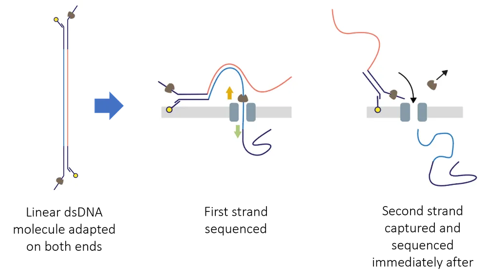{fig-align="center" width="900"}](https://nanoporetech.com/document/kit-14-device-and-informatics)

## ONT - Tipos de leitura

-   `Simplex`: O sequenciamento de uma única fita. A fita de DNA modelo passa pelo nanoporo e é submetida ao basecalling. Isso é realizado no MinKNOW.

-   `Duplex`: O sequenciamento de ambas as fitas. A fita complementar é lida imediatamente após a fita modelo e o basecalling consensual para ambas as fitas leva a um aumento ainda maior na precisão. Isso é realizado no Dorado.

::: aside
MinKNOW é o software que controla o sequenciamento.
:::

## ONT - Leitura da fita

:::::: columns
::: {.column width="50%"}
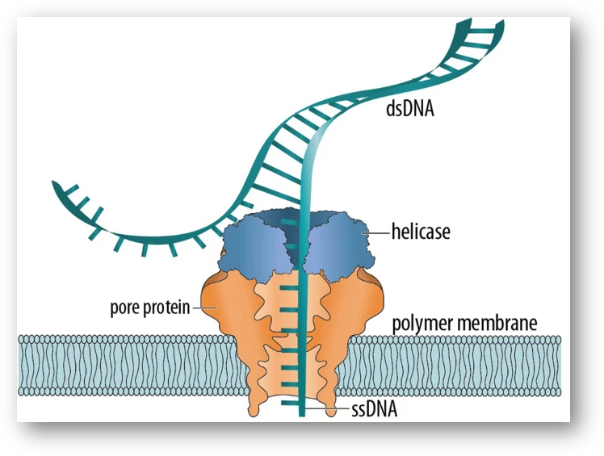
:::

:::: {.column width="50%"}
::: {style="font-size: 80%"}
:::
::::
::::::

## ONT - Leitura da fita

:::::: columns
::: {.column width="50%"}

:::

:::: {.column width="50%"}
::: {style="font-size: 80%"}
-   Leitura DNA = 400 bp por segundo;

-   RNA = 70 bp por segundo;

-   6 bases simultâneas por poro;

-   {A,T,C,G};
:::
::::
::::::

## ONT - Leitura da fita

:::::: columns
::: {.column width="50%"}

:::

:::: {.column width="50%"}
::: {style="font-size: 80%"}
-   Leitura DNA = 400 bp por segundo;

-   RNA = 70 bp por segundo;

-   6 bases simultâneas por poro;

-   {A,T,C,G};

 

-   4x4x4x4x4x4 =?
:::
::::
::::::

## ONT - Leitura da fita

:::::: columns
::: {.column width="50%"}

:::

:::: {.column width="50%"}
::: {style="font-size: 80%"}
-   Leitura DNA = 400 bp por segundo;

-   RNA = 70 bp por segundo;

-   6 bases simultâneas por poro;

-   {A,T,C,G};

 

-   4x4x4x4x4x4 =?

 

-   4096 combinações!
:::
::::
::::::

## ONT - Leitura da fita

::: center
[{width="488"}](https://nanoporetech.com/platform/technology/basecalling)
:::

## ONT - RNA

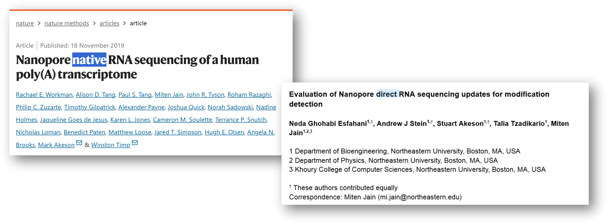{fig-align="center" width="1300"}

## ONT - RNA

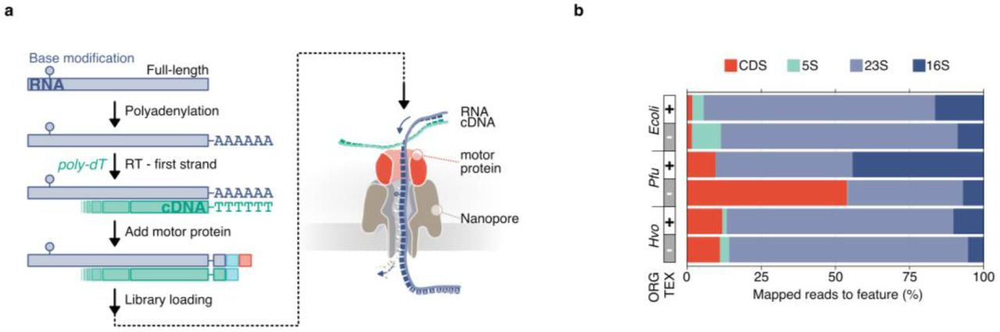{fig-align="center" width="1300"}

## Modificações de bases

. . .

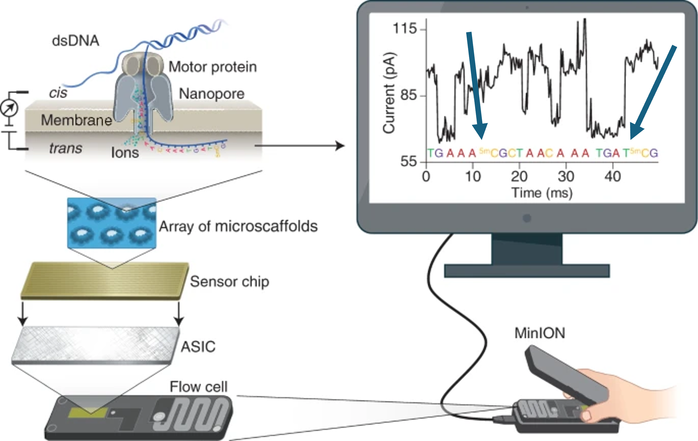{fig-align="center" width="806"}

## Modificações de bases

-   Existem cerca de 30 modificações de base descrita!

. . .

::::: columns
::: {.column width="50%"}
{A, T, C, G, 5mC}
:::

::: {.column width="50%"}
{A, T, C, G, 5mC, 5hmC}
:::
:::::

## Modificações de bases

-   Existem cerca de 30 modificações de base descrita!

::::: columns
::: {.column width="50%"}
{A, T, C, G, 5mC}

 

5x5x5x5x5x5 = 15625 combinações!
:::

::: {.column width="50%"}
{A, T, C, G, 5mC, 5hmC}

 

6x6x6x6x6x6 = 46656 combinações!
:::
:::::

## Basecallers

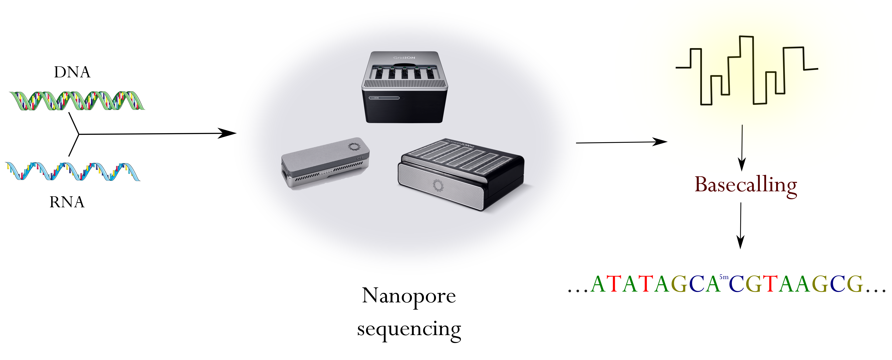{fig-align="center" width="1200"}

## Basecallers

-   Nanoporos diferentes contêm "leitores" diferentes;

    -   R10.4.1 é o modelo atual;

-   Capturam o sinal elétrico (POD5);

-   Basecallers transformam POD5 em FASTQ;

-   Utilizam Machine Learning (RNN);

-   Este processo pode ser feito em tempo real;

::: aside
POD5 é o formato atual, mas pode-se encontrar FAST5;
:::

## Basecallers

[{fig-align="center" width="565"}](https://nanoporetech.com/platform/technology/basecalling)

## Basecallers

[{fig-align="center" width="1200"}](https://nanoporetech.com/platform/technology/basecalling)

## Basecallers

Sugestão de leitura:

-   *"**From squiggle to basepair: computational approaches for improving nanopore sequencing read accuracy**"* [@rang2018]\[[link](https://genomebiology.biomedcentral.com/articles/10.1186/s13059-018-1462-9)\]

## Bancada

. . .

-   hmwDNA;

. . .

-   Alta pureza;

. . .

-   Não há necessidade de PCR;

. . .

-   Não há necessidade conversões por bissulfito de sódio (e afins);

## Bancada - Extração

-   Parte crucial!

 

-   Vale o investimento;

 

-   Vários kits de extração já foram validados pela comunidade;

## Bancada - Controle de qualidade

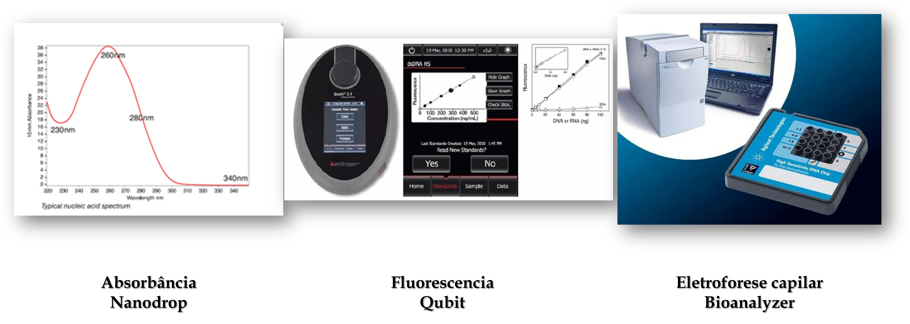{width="1200"}

::: aside
Agilent Femto Pulse (for fragments \>10 kb), or the Agilent Bioanalyzer (for fragments \<10 kb)
:::

## Enriquecimento do sequenciamento

-   Você não precisa sequenciar o genoma completo necessariamente!

. . .

::: {style="text-align: center;"}
<iframe src="https://giphy.com/embed/XR9Dp54ZC4dji" width="480" height="288" style frameBorder="0" class="giphy-embed" allowFullScreen>

</iframe>

<a href="https://giphy.com/gifs/mrw-thanks-server-XR9Dp54ZC4dji">via GIPHY</a>

:::

## Enriquecimento do sequenciamento

. . .

-   ***Target***;

. . .

-   ***CRISPR-Cas9***;

. . .

-   ***Adaptive sampling***;

## Enriquecimento do sequenciamento

[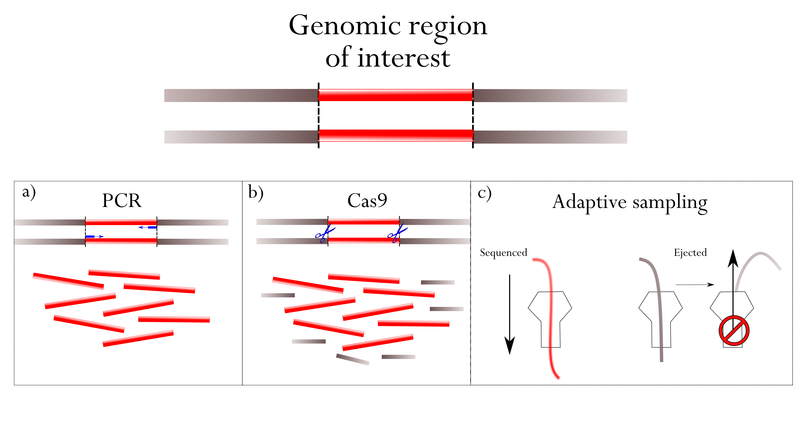{fig-align="center" width="1200"}](https://www.sciencedirect.com/science/article/pii/S1872497324001522)

## CRISPR-Cas9

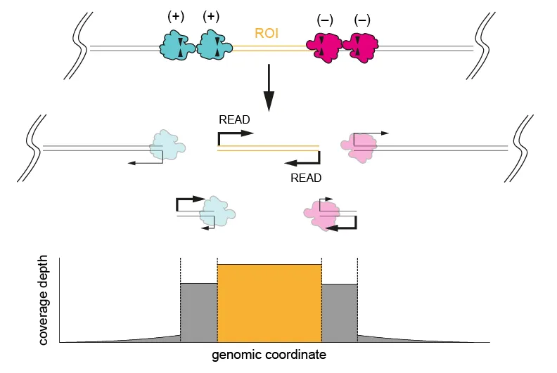{fig-align="center" width="950"}

## CRISPR-Cas9

-   **Excision**;

-   **Single cut and read out;**

-   **Tiling;**

## CRISPR-Cas9

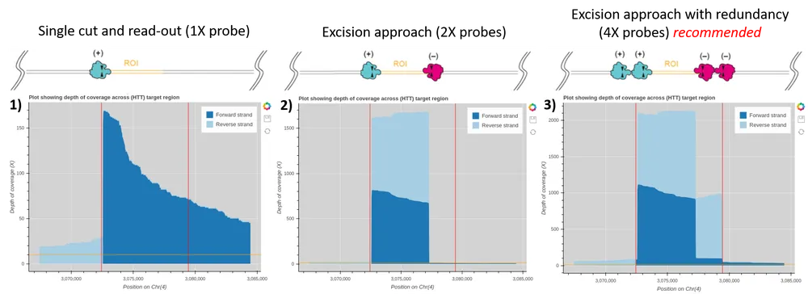{fig-align="center"}

## CRISPR-Cas9

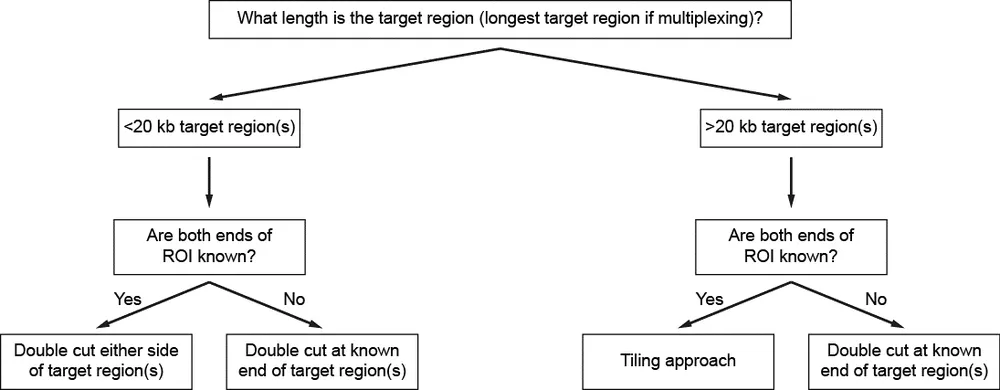{fig-align="center"}

## CRISPR-Cas9

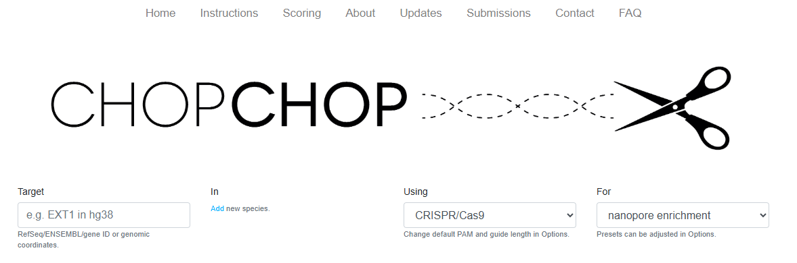{fig-align="center"}

## Adaptive sampling

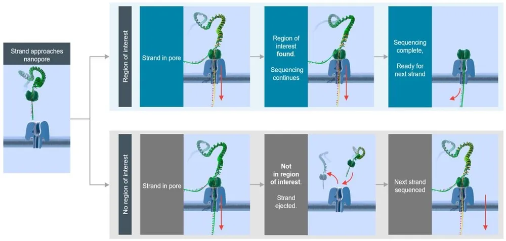{fig-align="center" width="1200"}

## Adaptive sampling

-   Enriquecimento das ROI \~5 a 10 vezes;

-   Ideal é que a fração enriquecida seja inferior 10% do genoma (320 Mb);

. . .

-   Cuidados: ***Ocupação dos poros*** e ***fragmentação da biblioteca***;

. . .

-   As regiões escolhidas são colocadas em um arquivo BED;

-   É necessário um computador com maior capacidade;

## Potencial

## Potencial - montagem de genomas

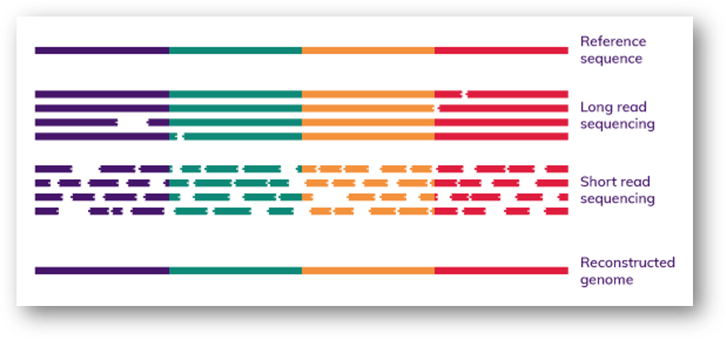{fig-align="center" width="1000"}

## Potencial - montagem de genomas

[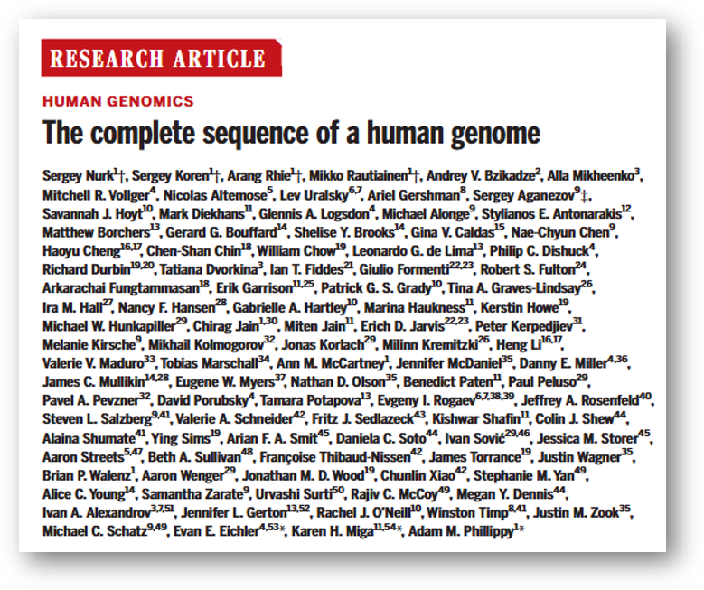{fig-align="center" width="596"}](https://www.science.org/doi/10.1126/science.abj6987)

::: aside
[@nurk2022]
:::

## Potencial - montagem de genomas

[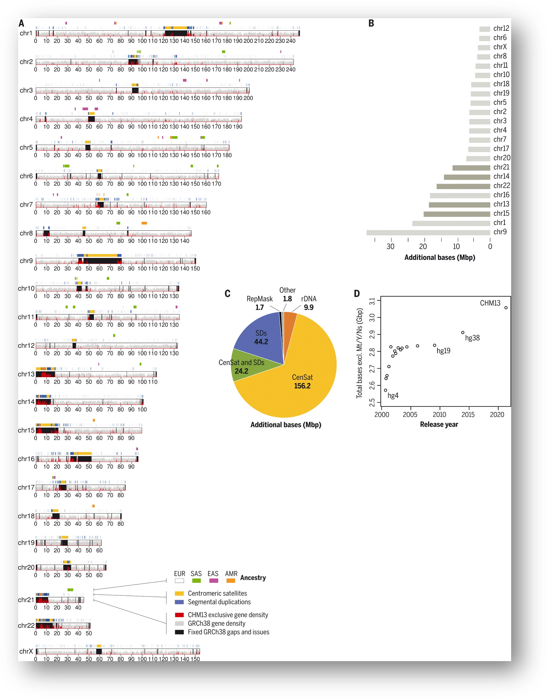{fig-align="center" width="393"}](https://www.science.org/cms/10.1126/science.abj6987/asset/ec796ff1-289e-43cf-a065-ec6573199a8d/assets/images/large/science.abj6987-f1.jpg)

## Potencial - haplótipos longos

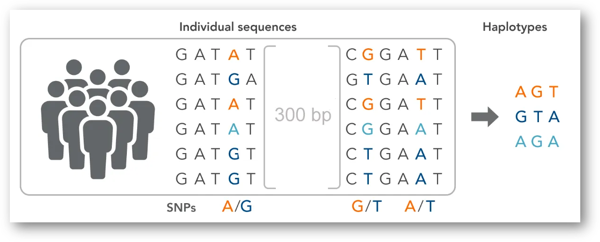{fig-align="center" width="1200"}

## Potencial - haplótipos longos

[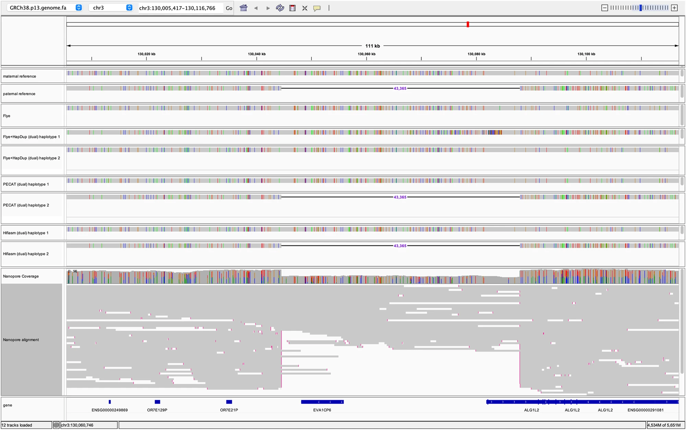{fig-align="center" width="797"}](https://www.nature.com/articles/s41467-024-47349-7/figures/4)

## Potencial - Variantes estruturais

## Potencial - metilação

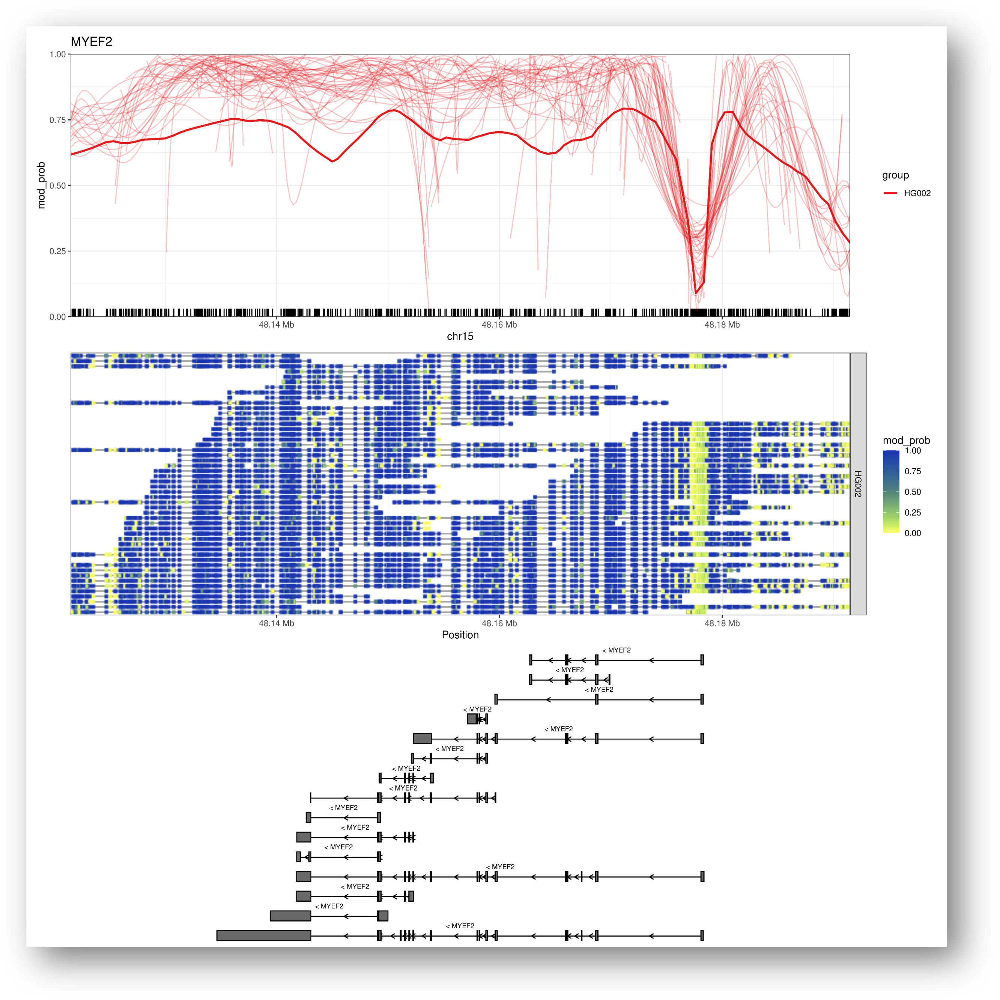{fig-align="center" width="500"}

## Potencial - outros

-   STR [@luo2024];

 

-   Elementos transponíveis [@smits2022];

 

-   Epitranscriptômica [@Workman2019; @Begik2022; @Jain2022];

## Estado atual

[{fig-align="center" width="1200"}](https://nanoporetech.com/platform/accuracy)

$$
P = 10^{\frac{-Q}{10}}
$$

## Estado atual

[{fig-align="center" width="608"}](https://nanoporetech.com/platform/accuracy)

## EPI2ME

::: {style="text-align: center;"}
> Quem tem medo de programação?

<iframe src="https://giphy.com/embed/Df1O9eIsMFASA" width="480" height="324" style frameBorder="0" class="giphy-embed" allowFullScreen>

</iframe>

`
<a href="https://giphy.com/gifs/punch-monitor-Df1O9eIsMFASA"`{=html}via GIPHY</a>

:::

## EPI2ME

::::: columns
::: {.column width="50%"}
-   [EPI2ME](https://epi2me.nanoporetech.com/wfindex/) é uma coleção de pipelines fornecidos pela própria ONT;

-   Nextflow;

-   Útil para quem quer ou não programar;
:::

::: {.column width="50%"}
[{fig-align="center" width="450"}](https://epi2me.nanoporetech.com/wfindex/)
:::
:::::

## Futuro da tecnologia

[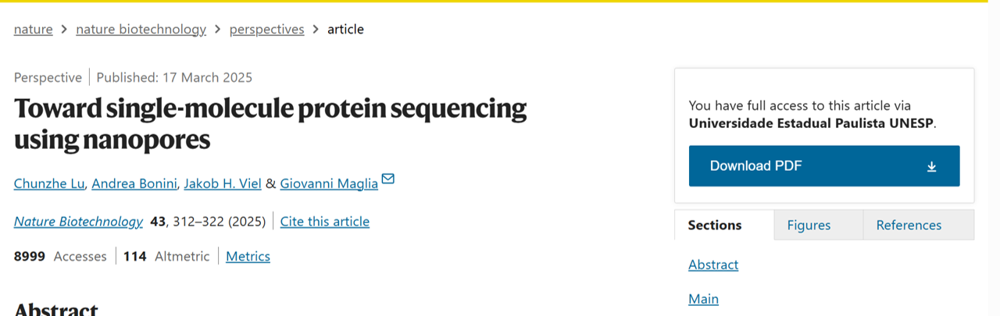{fig-align="center"}](https://www.nature.com/articles/s41587-025-02587-y#citeas)

## Futuro da tecnologia

[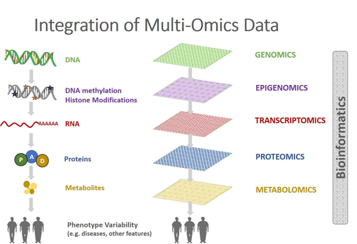{fig-align="center"}](https://comics.dcv.fct.unl.pt/resources/)

## Desafios (e frustrações)..

::: {style="text-align: center;"}
<iframe src="https://giphy.com/embed/2zdVnqmhSfAvyQhzHj" width="480" height="480" style frameBorder="0" class="giphy-embed" allowFullScreen>

</iframe>

`
<a href="https://giphy.com/gifs/showtime-season-4-episode-2zdVnqmhSfAvyQhzHj"`{=html}via GIPHY</a>

:::

## Desafios (e frustrações)..

[{width="418"}](https://github.com/rrwick)

"May 2025 update

I've recently heard that ONT is deprecating duplex basecalling -- not surprising given their recent silence on the topic. This is now the third time (after 2D and 1D2) that ONT has tried and dropped both-strand basecalling! So it seems that mixed simplex-duplex read sets like the ones in this post will end up a historical curiosity rather than a standard part of ONT sequencing." \[[link](https://rrwick.github.io/2024/05/08/duplex_assemblies.html)\]

## O que eu preciso saber para começar?

## Quais os principais custos?

## Que tipo de computador usar?