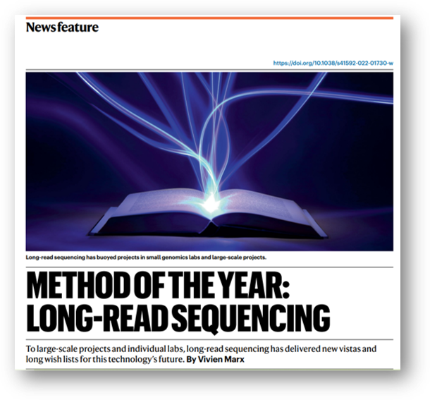
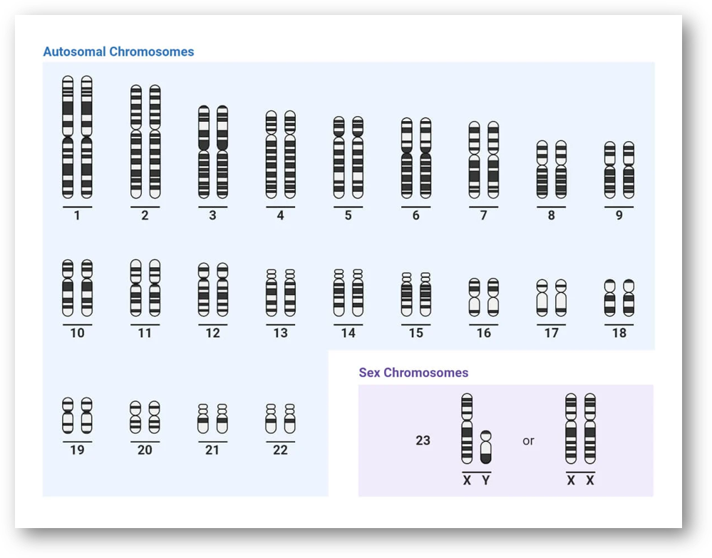
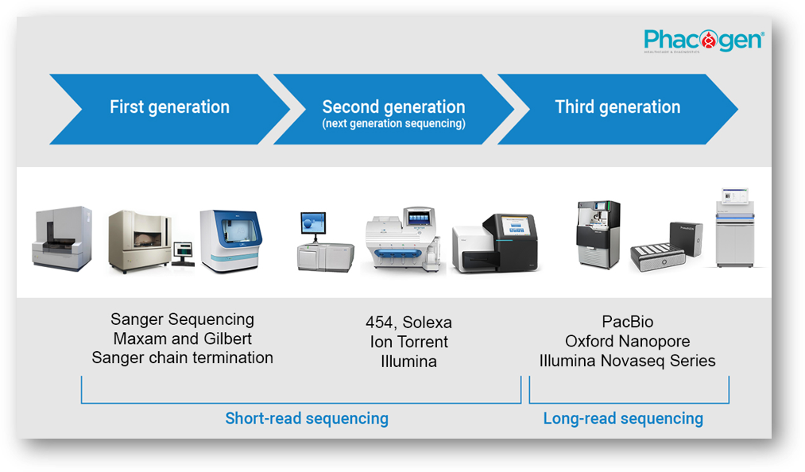
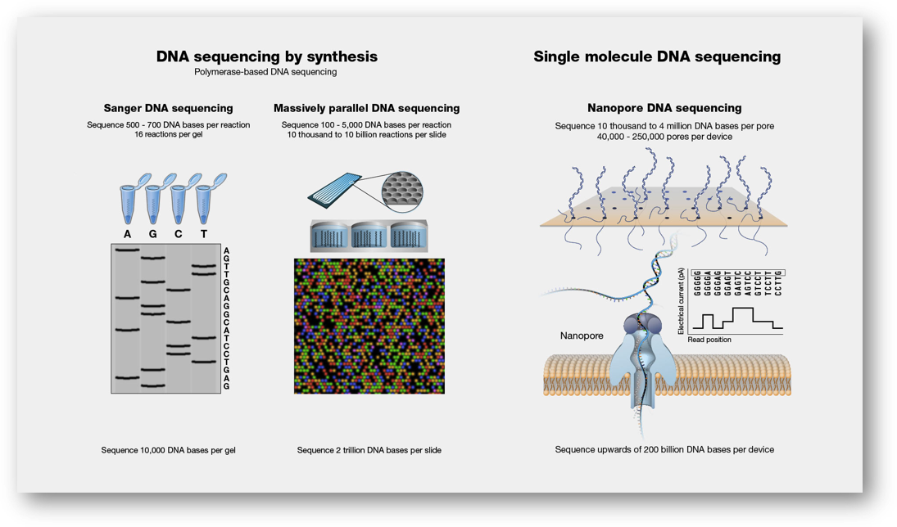
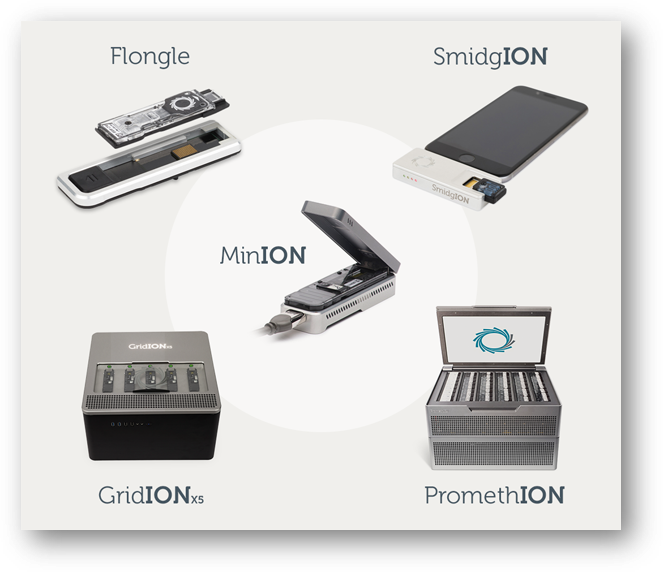
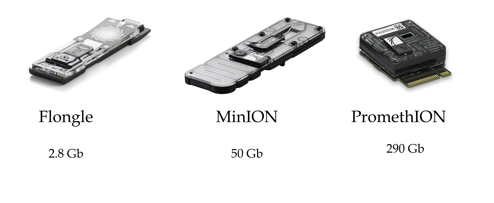

# Sobre mim

## Muito prazer..

::: columns
::: {.column width="50%"}
{fig-align="center" width="420"}
:::

::: {.column width="50%" style="font-size: 80%;"}
-   Marcel;

 

-   Físico médico;

 

-   Me e PhD em Biotecnologia;

 

-   Desde 2023, pós-doutorado em genética;
:::
:::

## Interesses

::: columns
::: {.column width="50%"}
{fig-align="center" width="420"}
:::

::: {.column width="50%" style="font-size: 80%;"}
-   Métodos alternativos ao uso de animais;

-   Identificão humana via DNA;

-   Biologia do tecido ósseo;

-   Biomateriais;

-   Regeneração tecidual;

-   Ciência aberta;

 

::: {#red-highlight style="color: red; font-size: 140%; text-align: center; font-weight: bold;"}
Bioinformática
:::
:::
:::

## Projeto

[{fig-align="center" width="780"}](https://isbet.org.br/diversidade-no-estagio-e-jovem-aprendiz/)

## Não sou da nanopore

::: {style="text-align: center;"}
<iframe src="https://giphy.com/embed/zFa3vjySsETPa" width="414" height="480" style frameBorder="0" class="giphy-embed" allowFullScreen>

</iframe>

<a href="https://giphy.com/gifs/zFa3vjySsETPa">via GIPHY</a>

:::

# Sobre vocês

## Sobre vocês

::: {style="text-align: center;"}
<iframe src="https://giphy.com/embed/5wWf7H89PisM6An8UAU" width="960" height="558" style frameBorder="0" class="giphy-embed" allowFullScreen>

</iframe>

<a href="https://giphy.com/gifs/editingandlayout-the-office-michael-scott-5wWf7H89PisM6An8UAU">via GIPHY</a>

:::

# Sobre esse minicurso

## Primeira edição (de muitas...🙏)

-   Desde maio estou como colaborador no programa de Genética do IBB;

 

-   Infelizmente não terá pratica;

 

-   Vamos aprofundar sobre aspectos de bioinformática das análises;

 

## Método do ano de 2022

[{fig-align="center" width="516"}](https://www.nature.com/articles/s41592-022-01730-w)

## Passar os atalhos

::: columns
::: {.column width="50%"}
<iframe src="https://giphy.com/embed/1n833bZxdzKzaErLe9" width="480" height="269" style frameBorder="0" class="giphy-embed" allowFullScreen>

</iframe>

<a href="https://giphy.com/gifs/nba-expression-derrick-white-1n833bZxdzKzaErLe9">via GIPHY</a>

:::

::: {.column width="50%"}
<iframe src="https://giphy.com/embed/Cas0va26zqBvTO5vY9" width="480" height="480" style frameBorder="0" class="giphy-embed" allowFullScreen>

</iframe>

<a href="https://giphy.com/gifs/pudgypenguins-rage-enough-ragequit-Cas0va26zqBvTO5vY9">via GIPHY</a>

:::
:::

## Bioinformática

-   NIH: "*Bioinformatics, as related to genetics and genomics, is a scientific subdiscipline that involves using computer technology to collect, store, analyze and disseminate biological data and information, such as DNA and amino acid sequences or annotations about those sequences.*"

::: aside
NIH: National Institute of Health
:::

## Bioinformática

-   NIH: "*Bioinformatics, as related to **genetics** and **genomics**, is a scientific subdiscipline that involves using computer technology to **collect**, **store**, **analyze** and **disseminate** biological data and information, such as **DNA** and **amino acid sequences** or annotations about those sequences.*"

::: aside
NIH: National Institute of Health
:::

## Bioinformática

-   Não vamos focar nos algoritmos;

 

-   Mas sim nos dados produzidos e como analisa-los;

# Sequenciamento via ONT

## Ordens de Grandeza do Genoma Humano

-   Número de cromossomos: 46 (23 pares);

-   Tamanho do genoma haploide: \~3,2 bilhões de pares de bases (3,2 Gb);

-   Número estimado de genes codificadores de proteínas: \~20.000;

## 

{fig-align="center"}

## Por que sequenciar?

. . .

-   A sequência é a "receita" da vida

    -   Ela determina a estrutura e função das moléculas biológicas.

-   **DNA** → **RNA** → **Proteína**

    -   Alterações na sequência podem afetar a função celular e causar doenças.

-   Entender a sequência = entender o funcionamento dos organismos

    -   Do gene à característica observável (fenótipo).

-   Permite identificar diferenças genéticas

    -   Entre indivíduos, espécies, populações ou células (ex: câncer).

## Geração de sequenciamento

## Sequenciamento: Comparativo entre Plataformas

 

::: {style="font-size:80%;"}
|                |                              |                         |                     |                       |                                                      |
|-----------|-----------|-----------|-----------|-----------|----------------|
| **Plataforma** | **Tipo de Leitura**          | **Tamanho de Leitura**  | **Taxa de Erro**    | **Tempo de Execução** | **Aplicações Comuns**                                |
| Illumina       | Short reads                  | 150--300 pares de bases | \<1%                | 1--2 dias             | RNA-seq, exoma, WGS, genotipagem                     |
| PacBio Hifi    | Long reads (alta fidelidade) | 10--25 kb (HiFi)        | \~1%                | 1--2 dias             | Montagem genômica, haplótipos, variantes estruturais |
| Oxford Nanopre | Long/ultralong reads         | 10 kb -- \>1 Mb         | 5--10% (melhorando) | Horas a 2 dias        | Metagenômica, epigenética, transcriptômica, forense  |
:::

## Introdução a tecnologia de sequenciamento

[{fig-align="center"}](https://www.genome.gov/geneticsglossary/DNASequencing#:~:text=DNA%20sequencing%20refers%20to%20the,use%20to%20develop%20and%20operate.)

## Oxford nanopore technologies (ONT)

. . .

::: columns
::: {.column width="50%"}
{fig-align="left"}
:::

::: {.column width="50%"}
::: {style="font-size: 80%;"}
-   Portátil e escalável;

-   "Barato";

-   Aquisição de dados em tempo real;

-   Altos volumes de dados (fastq \> 50 Gb);

-   DNA\* e RNA\*;

-   Long reads (10 kb -- 100 Kb);

-   Ultra (100 Kb -- 300 Kb);

-   Recorde 4 Mb!!!!!!;

-   Acurácia atual de \>99%;
:::
:::
:::

## ONT - Flowcells

{fig-align="center"}

## ONT - Princípio

![[@wang2021]](img/ont_principle.png){fig-align="center"}

## ONT - Princípio



## ONT - Nanoporos

![Lu, C., Bonini, A., Viel, J.H. et al. Toward single-molecule protein sequencing using nanopores. Nat Biotechnol 43, 312--322 (2025). [@Lu2025]](img/napores.png)
